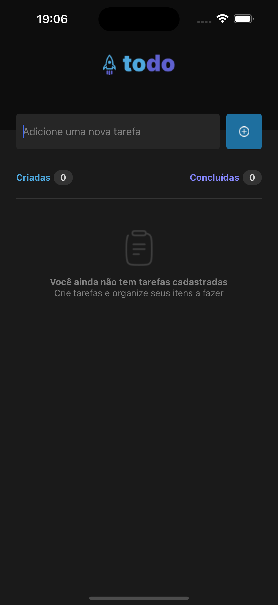
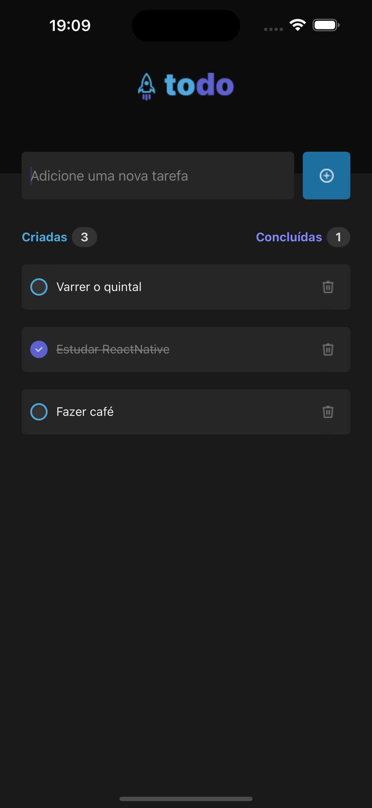
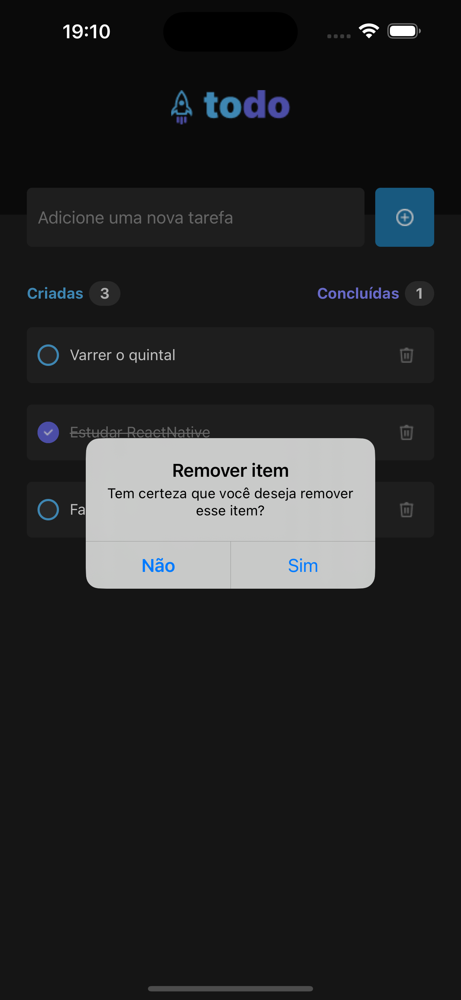

<h1 align="center">
  <a href="https://reactnative.dev/">
    React Native
  </a>
</h1>

<p align="center">
  
  
  
  
  
</p>

## 💻 Projeto

Esse projeto é um Todo List mobile.
Nele podemos criar tarefas, marcar como concluídas e remover. Tudo em uma interface amigável e feito sem nenhum adicional de bibliotecas a não ser as já entregues pelo template sugerido na documentação.

## 📷 Screen shots

<p align="center">



</p>

## ✍️ Instrução

### Pré configuração.
>Para executar esse projeto será necessário ter o [node](https://nodejs.org/en) e [yarn](https://yarnpkg.com/) instalados, de preferência para as versões apresentadas nas tags do início desse readme.

>Além disso você precisa ter instalado o [expo](https://play.google.com/store/apps/details?id=host.exp.exponent&hl=pt_BR&gl=US&pli=1) instalado em algum dispositivo mobile.

Após instalação, garanta que está no diretório do projeto e siga os passos:
```bash
# instalação dos pacotes
$ yarn

# execução do servidor
$ yarn start
```

Agora basta abrir o `expo` no seu dispositivo mobile e abrir um novo projeto com QRCode que será gerado no terminal.